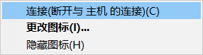

# 将iOS设备连接到macOS

如果您已经完成前面的步骤，那么恭喜您，您已经离成功不远了。

## 如果您使用的是运行在实体机上的macOS

使用数据线将您的iOS设备连接到电脑，然后[请点击这里跳转到“连接到AnyGo](jiang-ios-she-bei-lian-jie-dao-macos.md#kai-shi-lian-jie)[”。](jiang-ios-she-bei-lian-jie-dao-macos.md#kai-shi-lian-jie)

## 如果您使用的是：VMware虚拟机

使用数据线将您的iOS设备连接到电脑。此时VMware Workstation会询问您将设备连接到哪一台设备。此时，请您先点击“连接到虚拟机”，再点击您的虚拟机名称。

<figure><figcaption></figcaption></figure>

如果您没有看到这个弹窗：

请您将鼠标移动到VMware Workstation 右下角的状态栏。如果您的手机已经正确连接到您的PC，您会看到一个灰色的矩形。

如图所示：

点击这个图标，您会看到如下图所示的弹窗。点击“连接（断开与 主机 的连接）”，即可将iPhone连接到虚拟机内的macOS。

## 连接到AnyGo

点击“开始”，等待电脑识别您的设备。

点击屏幕右下角的“下一页”，如果提示解锁屏幕则解锁屏幕，提示输入密码则在手机上输入锁屏密码，等待加载完成。

现在您应该看见如下画面，说明加载完成，您的iOS设备定位已经被AnyGo控制。

<figure><figcaption>
AnyGo界面
</figcaption></figure>
