# 在PC上安装macOS虚拟机

## 开始之前

您可以参阅[其他人的教程](http://mp.weixin.qq.com/s?\_\_biz=MzIxOTE5MDY5Mw==\&mid=2650891941\&idx=1\&sn=a0e3624fdc8aaaeb0e0053f7d7e62a86\&chksm=8c2ac26fbb5d4b79a30163c2c3c4a50694dd224f1dd576cbb0f91e3d39c41b20fbb64f0bd8b9\&scene=21#wechat\_redirect)，因笔者水平有限，您目前正在阅读的这篇教程可能有纰漏之处。

您可以前往[这个链接](https://www.123pan.com/s/0pMUVv-892x)（在下文也有给出）找到所需的macOS镜像。

## 环境准备

安装前打开任务管理器查看是否开启虚拟化。如果虚拟化未启用，需要在BIOS界面设置。如果是笔记本用户请查询你的笔记本型号；主机用户百度主板型号。

<figure><figcaption></figcaption></figure>

## 安装VMware Workstation并解锁

VMware Workstation Pro 16安装包点击[这个链接](https://download3.vmware.com/software/wkst/file/VMware-workstation-full-16.0.0-16894299.exe)即可下载（官方链接，请放心下载）。

运行下载得到的安装包。经过一段时间后，您会看到这个窗口：

<figure><figcaption></figcaption></figure>

点击“下一步”，您需要阅读并同意VMware的EULA。

建议您阅读并同意后，勾选“我接受许可协议中的条款”，点击“下一步”。

<figure>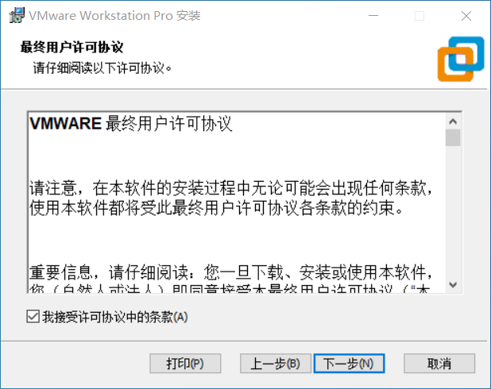<figcaption></figcaption></figure>

安装过程基本就是一直下一步，最后结束的时候输入密钥。

这页不需要额外设置。

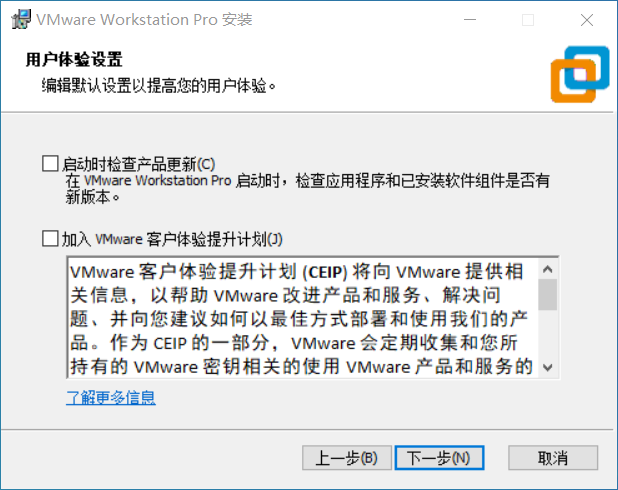

&#x20;建议取消勾选两个复选框（分别点击两个带对勾的方框）。

.png>)

这页不需要额外设置。

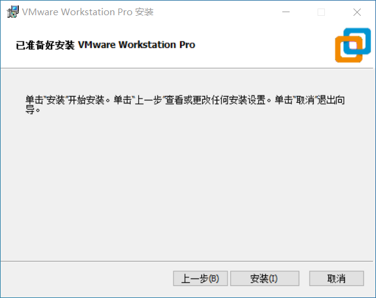

现在您可以点击“安装”开始安装VMware Workstation。

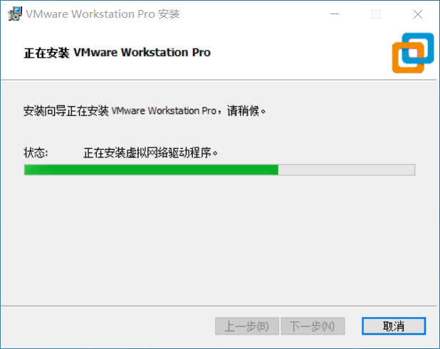

等待安装进度完成。

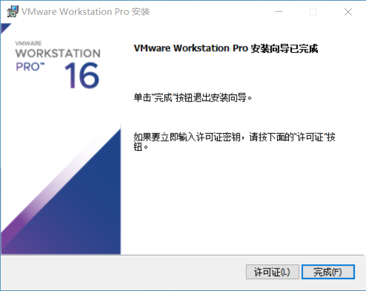

安装进度完成后，点击“许可证”来输入许可证。因版权等问题，关于安装包、密钥的其他事项请查阅[这个链接](https://www.ssymon.com/archives/vmware-download-key)。


盗版软件是一种**非法行为。**但值得一提的是，VMware Inc. 对于个人用户的盗版行为持睁一只眼闭一只眼的态度。如果您担心在学习、研究或欣赏VMware软件时带来的潜在盗版问题，您可以前往VMware官方网站下载**VMware Player**。VMware Player是一款免费软件。下文提及的unlocker同样适用于VMware Player。


输入许可证后，点击“输入”，即可用许可证注册Workstation。

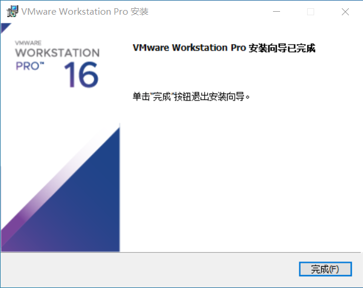

点击“完成”按钮即可完成VMware Workstation的安装程序。

## 解锁安装macOS

VMware Workstation 原生不支持安装macOS，需要使用其他程序解锁这个限制。

本次解锁使用的工具为GitHub上的 unlocker:[ https://github.com/DrDonk/unlocker/releases](https://github.com/DrDonk/unlocker/releases)

如果您不会使用Github，或上方链接不能下载，请点击[这个链接](https://www.123pan.com/s/0pMUVv-092x)（123云盘）来下载。

您下载后会得到如下压缩包。

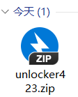

解压后您会得到如图的文件：

<figure>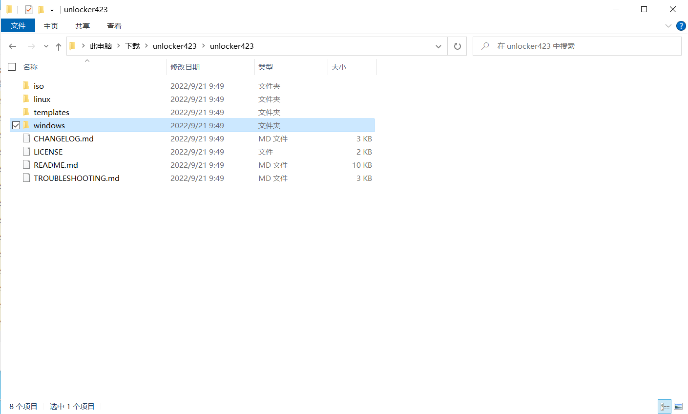<figcaption></figcaption></figure>

进入**上图文件夹中的**“windows”文件夹。注意，此处的windows文件夹指的**不是**`C:\Windows`。

解锁前请先去任务管理器关闭VMware程序，同时在服务中关闭所有vm开头的服务（解锁完成后请再打开）。

<figure><figcaption></figcaption></figure>

<figure>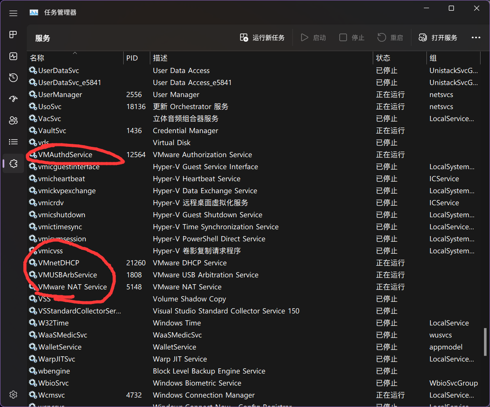<figcaption>
关闭VM开头的服务
</figcaption></figure>

在windows文件夹中，右键“unlock”应用程序，选择“以管理员身份运行”。

<figure>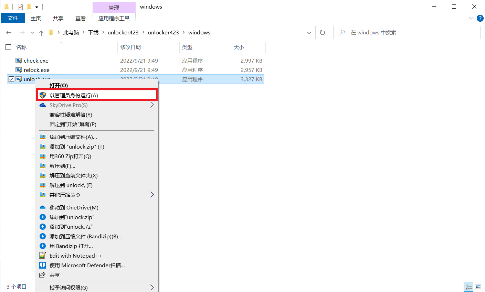<figcaption></figcaption></figure>

您可能会看到如图所示的信息。此时，点击“更多信息”。

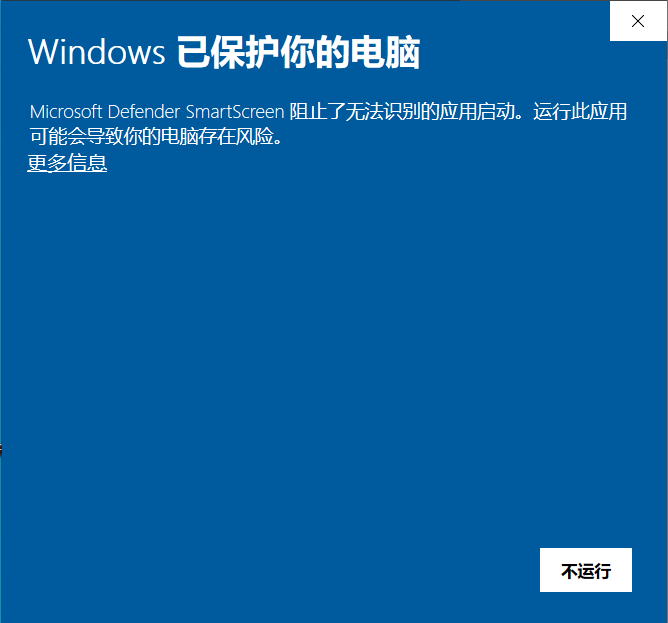

您会看到下图的画面。此时，点击“仍要运行”，unlocker程序会开始运行。

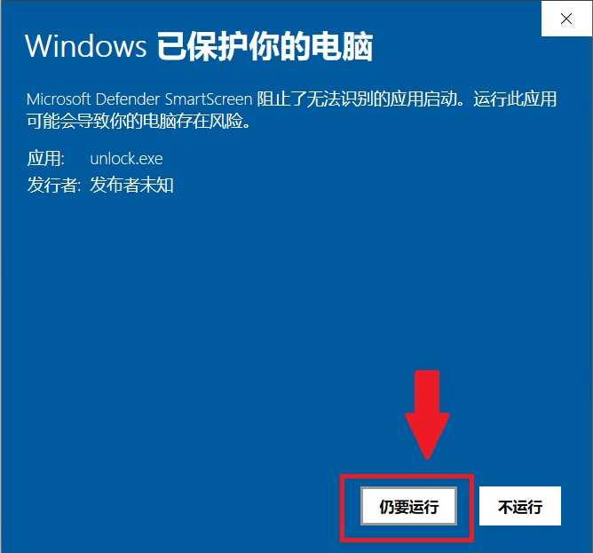

当您看到下图画面中显示“press Enter key to continue... ”，按下Enter键，unlocker程序会自动关闭，解锁已经完成。

<figure>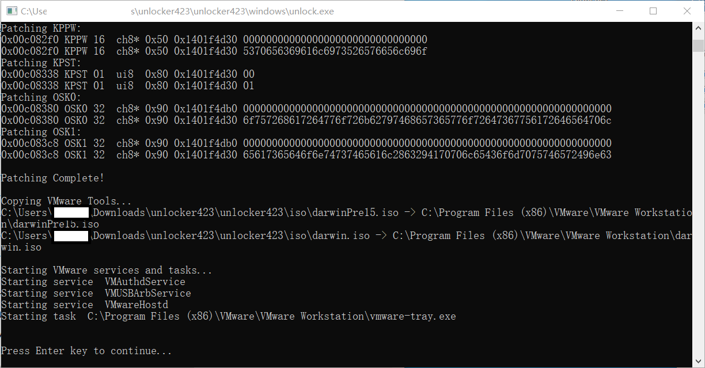<figcaption></figcaption></figure>

解锁不成功的可以尝试另一个解锁工具: [https://github.com/paolo-projects/unlocker](https://github.com/paolo-projects/unlocker)

## 在VMware Workstation中安装macOS

请前往[这个链接](https://www.123pan.com/s/0pMUVv-i92x)下载macOS Mojave的可引导镜像文件(Bootable ISO)。这个文件是由Apple Inc.官方工具生成的，没有对Apple的文件进行修改，不侵犯Apple Inc.的版权。

#### 致歉

这个ISO文件是笔者从可引导的U盘制作的镜像。令人感到疑惑的是，U盘可以在电脑上正常引导，而ISO文件则不能在workstation上引导，却可以在Fusion（Mac上的vmware虚拟机平台）上引导。笔者使用的是Mac和Fusion，因此并未发现这个问题。在此笔者向各位读者致歉。

如果您不知道什么是可引导镜像文件，请查阅：[什么是macOS苹果系统引导版镜像](https://www.loveswo.com/53.html)

如果您质疑为什么使用macOS Mojave，请查阅：[MacOS的Mojave和Catalina有什么不同的体验？](https://www.zhihu.com/question/349685707)

（还没写完）

现在，请您运行VMware Workstation主程序。您会看到如下窗口：

<figure><figcaption></figcaption></figure>

点击“创建新的虚拟机”，您会看到下图的窗口。

选择”典型“，然后点击”下一步“。您会看到如下画面：

选择“安装程序光盘映像文件”，然后点击“浏览”。

<figure><figcaption></figcaption></figure>

选择您刚刚下载的“Install macOS Mojave.iso”，然后点击“打开”。这之后，点击“新建虚拟机向导”窗口中的“下一步”。此时，您会看见下图所示的窗口：

在这个窗口中，您需要先选中“Apple Mac OS X”，然后在下方的“版本”下拉框中选择“macOS 10.14”。这之后，点击“下一步”。

为您的虚拟机选取一个名字和储存位置。


在macOS安装完成后，虚拟机占用的存储空间大约为21GB（按$$1GB=1\times10^9$$字节）。请考虑您选择的存储位置是否有充足的存储空间。


