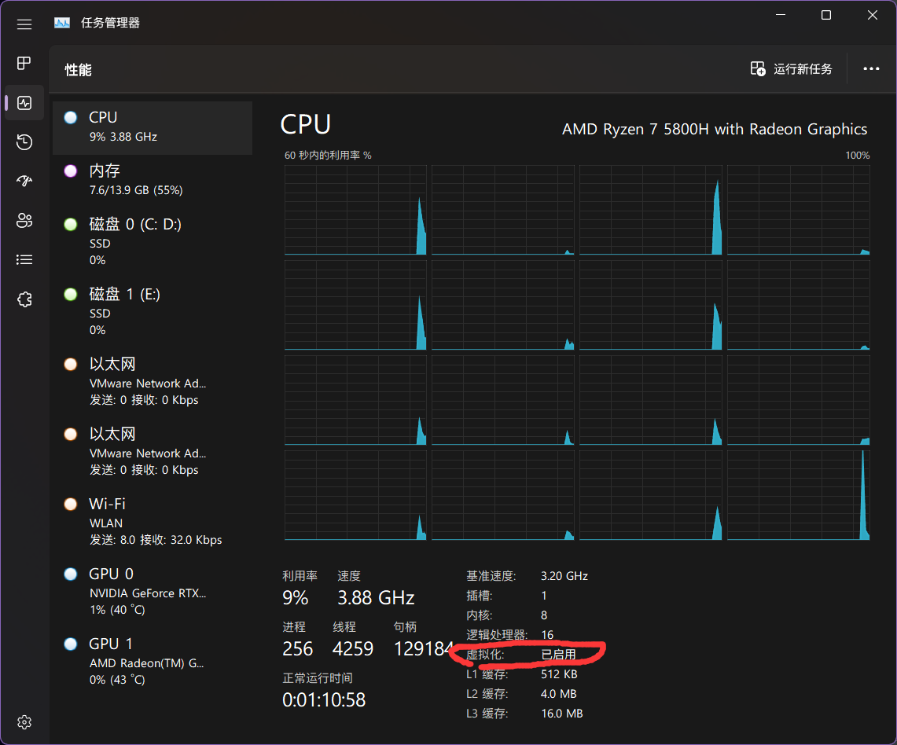
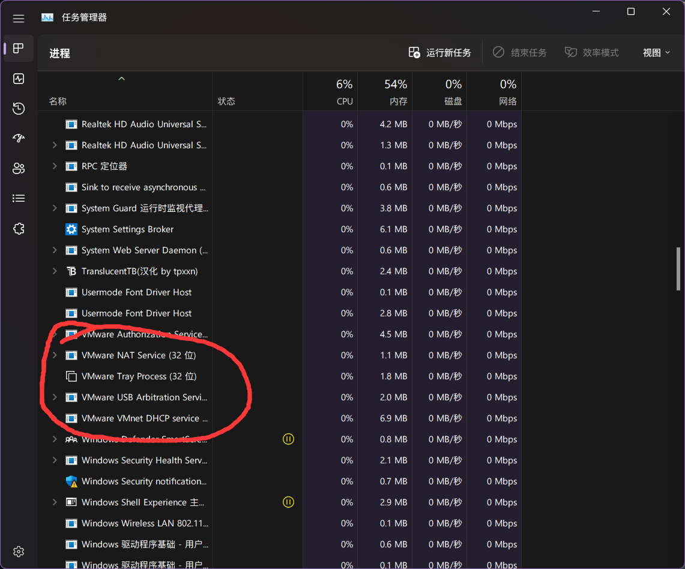

# 在PC上安装macOS虚拟机

## 开始之前

您可以参阅[其他人的教程](http://mp.weixin.qq.com/s?\_\_biz=MzIxOTE5MDY5Mw==\&mid=2650891941\&idx=1\&sn=a0e3624fdc8aaaeb0e0053f7d7e62a86\&chksm=8c2ac26fbb5d4b79a30163c2c3c4a50694dd224f1dd576cbb0f91e3d39c41b20fbb64f0bd8b9\&scene=21#wechat\_redirect)，因笔者水平有限，您目前正在阅读的这篇教程可能有纰漏之处。

您可以前往[这个链接](https://www.123pan.com/s/0pMUVv-892x)（在下文也有给出）找到所需的macOS镜像。

## 环境准备

安装前打开任务管理器查看是否开启虚拟化。如果虚拟化未启用，需要在BIOS界面设置。如果是笔记本用户请查询你的笔记本型号；主机用户百度主板型号。

<figure><figcaption></figcaption></figure>

## 安装VMware Workstation并解锁

VMware Workstation Pro 16安装包点击[这个链接](https://download3.vmware.com/software/wkst/file/VMware-workstation-full-16.0.0-16894299.exe)即可下载（官方链接，请放心下载）。

安装过程基本就是一直下一步，最后结束的时候输入密钥。

因版权等问题，关于安装包、密钥的其他事项请查阅[这个链接](https://www.ssymon.com/archives/vmware-download-key)。

## 解锁安装macOS

VMware Workstation 原生不支持安装macOS，需要使用其他程序解锁这个限制。

本次解锁使用的工具为GitHub上的 unlocker:[ https://github.com/DrDonk/unlocker/releases](https://github.com/DrDonk/unlocker/releases)

如果上方链接不能下载，请点击[这个链接](https://www.123pan.com/s/0pMUVv-092x)（123云盘）来下载。

解锁前请先关闭去任务管理器关闭VMware程序, 同时在服务中关闭所有vm开头的服务(请在解锁成功之后重新启用)

<figure><figcaption></figcaption></figure>

<figure><figcaption></figcaption></figure>

解锁压缩包之后, windows文件夹 -> 以管理员权限运行 unlock -> 任意键关闭

解锁不成功的可以尝试另一个解锁工具: [https://github.com/paolo-projects/unlocker](https://github.com/paolo-projects/unlocker)

## 在VMware Workstation中安装macOS

请前往[这个链接](https://www.123pan.com/s/0pMUVv-892x)下载macOS Mojave的可引导镜像文件(Bootable ISO)。这个文件是由Apple Inc.官方工具生成的，没有对Apple的文件进行修改，不侵犯Apple Inc.的版权。

如果您不知道什么是`可引导镜像文件`，请查阅：[什么是macOS苹果系统引导版镜像?](https://www.loveswo.com/53.html)

如果您质疑为什么使用macOS Mojave，请查阅：[MacOS的Mojave和Catalina有什么不同的体验？](https://www.zhihu.com/question/349685707)

（还没写完）

