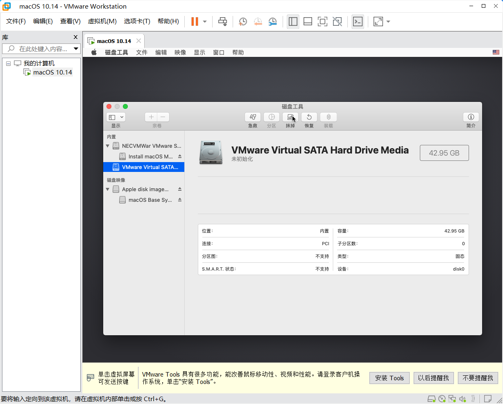

# 安装macOS

（还没写完）


在虚拟机内，macOS的性能有一定的折损。

因此，卡顿是正常的现象，尤其是当您的电脑本身性能较弱时。


现在，您应该能看到Apple的标志，如下方模拟图片绘制的。

<figure><figcaption></figcaption></figure>

等待虚拟机开机，您会看到如下画面：

此时，如果您希望使用简体中文，请选择“简体中文”，然后点击下方的箭头。

<figure><figcaption></figcaption></figure>

您会看到如下画面。此时，请您点击“磁盘工具”，然后点击“macOS实用工具”窗口右下角的“继续”。

<figure><figcaption></figcaption></figure>

您会看到如下画面。

您需要点击macOS中窗口的左边栏（在下文中，如果没有特殊说明，边栏、顶栏等一概指的是macOS中的）内的“VMware Virtual SATA...”驱动器，再点击窗口顶栏中的“抹掉”图标。

<figure><figcaption></figcaption></figure>

如果您没有看见上述的“VMware Virtual SATA...”驱动器，请点击窗口左上角的“显示”图标，然后在下拉菜单中点击“显示所有设备”，如下图所示。

<figure><figcaption></figcaption></figure>

点击“抹掉”后，您会看到如图所示的窗口：

<figure><figcaption></figcaption></figure>

请点击“格式”下拉菜单，将其更改为“APFS”，如下图所示。

<figure><figcaption></figcaption></figure>

值得一提的是，如果您如笔者一样有强迫症，那么建议您在“名称”栏填入“Macintosh HD”。这个名称不会给电脑带来任何性能提升，但是“Macintosh HD”是每一台苹果电脑出场时默认的硬盘名称。


请不要修改“方案”一栏，否则会导致您的虚拟机无法启动。


<figure><figcaption></figcaption></figure>

显示“抹掉进程结束”后，点击“

<figure><figcaption></figcaption></figure>
