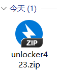
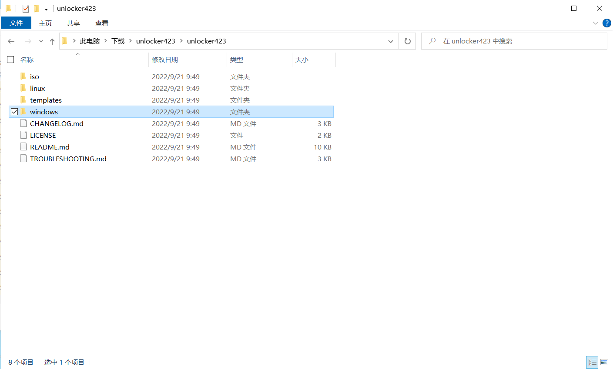
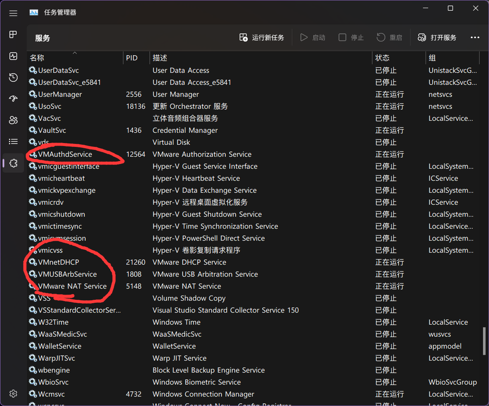
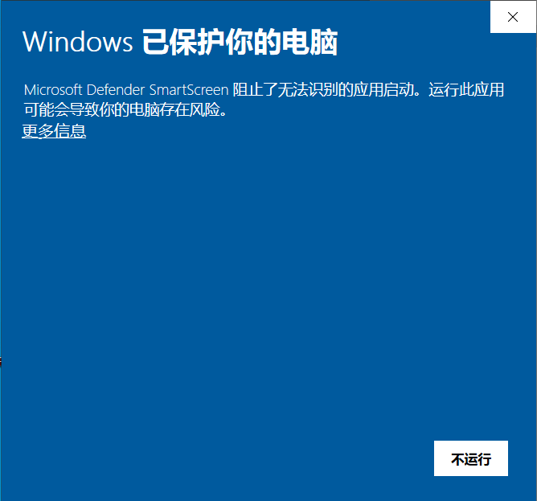
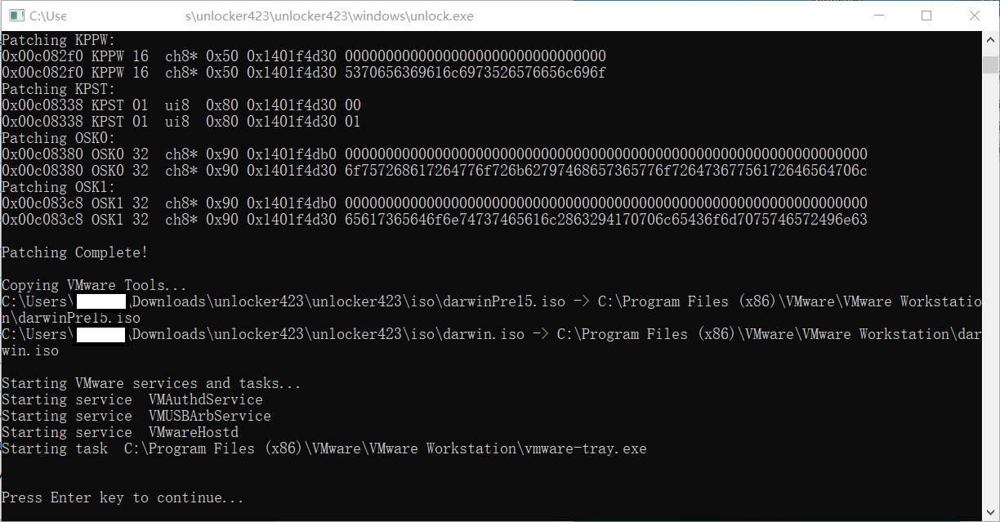

# 解锁安装macOS

VMware Workstation 原生不支持安装macOS，需要使用其他程序解锁这个限制。

本次解锁使用的工具为GitHub上的 unlocker:[ https://github.com/DrDonk/unlocker/releases](https://github.com/DrDonk/unlocker/releases)

如果您不会使用Github，或上方链接不能下载，请点击[这个链接](https://www.123pan.com/s/0pMUVv-092x)（123云盘）来下载。

您下载后会得到如下压缩包。

解压后您会得到如图的文件：

<figure><figcaption></figcaption></figure>

进入**上图文件夹中的**“windows”文件夹。注意，此处的windows文件夹指的**不是**`C:\Windows`。

解锁前请先去任务管理器关闭VMware程序，同时在服务中关闭所有vm开头的服务（解锁完成后请再打开）。

<figure><figcaption></figcaption></figure>

<figure><figcaption>
关闭VM开头的服务
</figcaption></figure>

在windows文件夹中，右键“unlock”应用程序，选择“以管理员身份运行”。

<figure><figcaption></figcaption></figure>

您可能会看到如图所示的信息。此时，点击“更多信息”。

您会看到下图的画面。此时，点击“仍要运行”，unlocker程序会开始运行。

当您看到下图画面中显示“press Enter key to continue... ”，按下Enter键，unlocker程序会自动关闭，解锁已经完成。

<figure><figcaption></figcaption></figure>

解锁不成功的可以尝试另一个解锁工具: [https://github.com/paolo-projects/unlocker](https://github.com/paolo-projects/unlocker)
