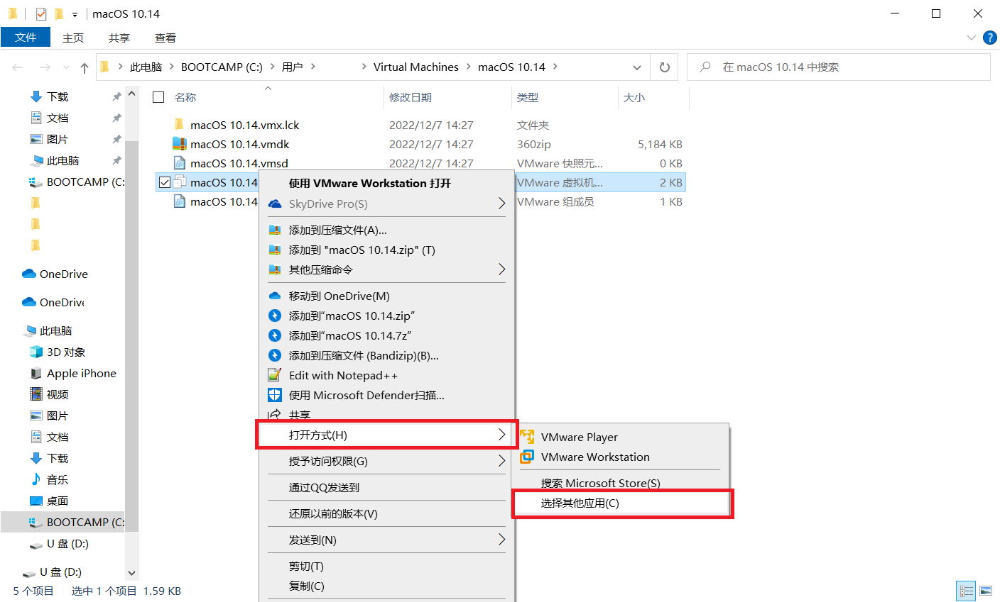

# 配置macOS的安装环境

请前往[这个链接](https://www.123pan.com/s/0pMUVv-i92x)下载macOS Mojave的可引导镜像文件(Bootable ISO)。这个文件是由Apple Inc.官方工具生成的，没有对Apple的文件进行修改，不侵犯Apple Inc.的版权。


#### 致歉

之前的镜像文件出现了问题。ISO文件是笔者从可引导的U盘制作的镜像。令人感到疑惑的是，U盘可以在电脑上正常引导，而ISO文件则不能在workstation上引导，却可以在Fusion（Mac上的vmware虚拟机平台）上引导。笔者使用的是Mac和Fusion，因此并未发现这个问题。在此笔者向各位读者致歉。

目前该问题已经修复。经测试，您下载的镜像可以在Workstation中引导。


如果您不知道什么是可引导镜像文件，请查阅：[什么是macOS苹果系统引导版镜像？](https://www.loveswo.com/53.html)

如果您质疑为什么使用macOS Mojave，请查阅：[MacOS的Mojave和Catalina有什么不同的体验？](https://www.zhihu.com/question/349685707)

现在，请您运行VMware Workstation主程序。您会看到如下窗口：

<figure><figcaption></figcaption></figure>

点击“创建新的虚拟机”，您会看到下图的窗口。

选择”典型“，然后点击”下一步“。您会看到如下画面：

选择“安装程序光盘映像文件”，然后点击“浏览”。

<figure><figcaption></figcaption></figure>

选择您刚刚下载的“Install macOS Mojave.iso”，然后点击“打开”。这之后，点击“新建虚拟机向导”窗口中的“下一步”。此时，您会看见下图所示的窗口：

在这个窗口中，您需要先选中“Apple Mac OS X”，然后在下方的“版本”下拉框中选择“macOS 10.14”。这之后，点击“下一步”。

为您的虚拟机选取一个名字和储存位置。


在macOS安装完成后，虚拟机占用的存储空间大约为21GB（按$$1GB=1\times10^9$$字节）。请考虑您选择的存储位置是否有充足的存储空间。


这步不需要额外设置，下一步即可。

.png>)

此时，您需要在这个窗口中点击“自定义硬件”。您会看到下图所示的窗口：

<figure><figcaption></figcaption></figure>

在这个窗口中，您可以更改虚拟机的内存大小。笔者的电脑内存大小为24GB，因此给虚拟机分配8GB。

macOS对内存需求较高，建议您为虚拟机设置大于4GB的内存（6144MB-8192MB是较好的选择）

点击左边栏中的“处理器”，即可设置虚拟机的CPU。考虑到macOS的兼容性，建议您设置为：1个CPU，如下图所示。

<figure><figcaption></figcaption></figure>

笔者的电脑处理器为8核心16线程，因此选择内核数量为6。建议您按照自己电脑的实际情况更改相关设置。

同时，建议您勾选“虚拟化Intel VT-x/EPT 或 AMD-V/RVI(V)”，这对macOS的稳定性有一定改善作用。

点击“关闭”按键，即可保存相关设置。接下来您会看到下图窗口，其向您展示了修改后的硬件信息。

点击“完成”，您会进入下图页面。

现在请您右键点击左侧边栏中的虚拟机名称，然后选择“打开虚拟机目录”。

<figure><figcaption></figcaption></figure>

您会看到如下文件夹。

右键点击文件夹中的“.vmx”格式的文件，滑到菜单中的“打开方式”，点击“选择其他应用”。

如果您没有看见文件扩展名vmx，请您参阅：[如何显示出文件的扩展名？](https://answers.microsoft.com/zh-hans/windows/forum/all/%E5%A6%82%E4%BD%95%E6%98%BE%E7%A4%BA%E5%87%BA/a16fb2a5-5d0c-42d7-90bc-3176cc055a5f)

<figure><figcaption></figcaption></figure>

此时您会看到下图所示的窗口。请您点击“更多应用”。

此时列表展开。向下滚动列表，点击“记事本”，然后点击“确定”。

将打开的文档滚动到最后一行，添加如下文字：

`smc.version = "0"`

如图所示。然后保存文件，关闭文件。

<figure><figcaption></figcaption></figure>

现在您应该回到VMware Workstation的界面。点击“开启此虚拟机”，macOS的安装镜像即将开始引导。

如果您没有看到这个界面，请您点击左边栏中的虚拟机名称。

<figure><figcaption></figcaption></figure>
