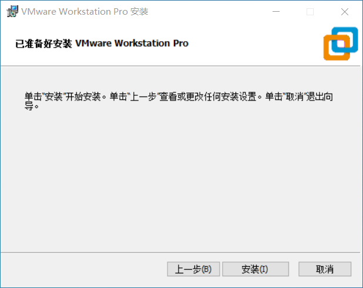
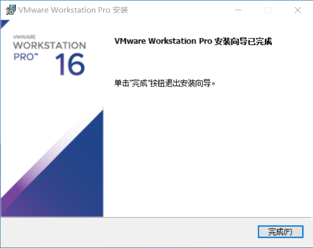

# 安装VMware Workstation

VMware Workstation Pro 16安装包点击[这个链接](https://download3.vmware.com/software/wkst/file/VMware-workstation-full-16.0.0-16894299.exe)即可下载（官方链接，请放心下载）。

运行下载得到的安装包。经过一段时间后，您会看到这个窗口：

<figure><figcaption></figcaption></figure>

点击“下一步”，您需要阅读并同意VMware的EULA。

建议您阅读并同意后，勾选“我接受许可协议中的条款”，点击“下一步”。

<figure><figcaption></figcaption></figure>

安装过程基本就是一直下一步，最后结束的时候输入密钥。

这页不需要额外设置。

&#x20;建议取消勾选两个复选框（分别点击两个带对勾的方框）。

.png>)

这页不需要额外设置。

现在您可以点击“安装”开始安装VMware Workstation。

等待安装进度完成。

安装进度完成后，点击“许可证”来输入许可证。因版权等问题，关于安装包、密钥的其他事项请查阅[这个链接](https://www.ssymon.com/archives/vmware-download-key)。


盗版软件是一种**非法行为。**但值得一提的是，VMware Inc. 对于个人用户的盗版行为持睁一只眼闭一只眼的态度。如果您担心在学习、研究或欣赏VMware软件时带来的潜在盗版问题，您可以前往VMware官方网站下载**VMware Player**。VMware Player是一款免费软件。下文提及的unlocker同样适用于VMware Player。


输入许可证后，点击“输入”，即可用许可证注册Workstation。

点击“完成”按钮即可完成VMware Workstation的安装程序。

